# MediaOps CoPilot — Complete Workflow Architecture

MediaOps CoPilot follows one central rule:

> **AI supplies judgment. Deterministic code supplies authority.**

Gemini-based agents observe, classify, and propose. Deterministic components
confirm evidence, authorize actions, execute approved actions, and verify that
the stream truly recovered. Firestore stores every transition under the
incident ID, making the complete journey durable and traceable.

```mermaid
flowchart TD
    Stream[Live video stream and telemetry] --> Monitor[Infra Health Monitor<br/>Poll health and confirm a sustained anomaly]
    Monitor -->|Sustained anomaly| Recorder[Incident Recorder<br/>Create incident ID and persist DETECTED]
    Monitor -->|Brief anomaly or duplicate| KeepWatching[Keep monitoring<br/>No new incident]

    Recorder --> Orchestrator[Orchestrator<br/>Coordinate the existing components]

    Orchestrator --> Vision[Vision Agent - AI<br/>Inspect the fault-specific video section]
    Orchestrator --> Infra[Infra Agent - AI<br/>Classify bounded infrastructure metrics]

    Vision --> VisionFinding[VisionFinding<br/>Symptom, description, confidence]
    Infra --> InfraFinding[InfraFinding<br/>Fault class, target, evidence, confidence]
    VisionFinding --> Aggregator[Evidence Aggregator<br/>Deterministically validate and compare witnesses]
    InfraFinding --> Aggregator

    Aggregator -->|Missing, invalid, or conflicting evidence| Escalated[ESCALATED<br/>Persist reason and stop safely]
    Aggregator -->|Witnesses corroborate| Evidence[Confirmed IncidentEvidence]

    Evidence --> KB[Knowledge Base retrieval<br/>Embeddings plus deterministic similarity]
    KB --> Remediation[Remediation Agent - AI<br/>Propose one action from the fixed enum]
    Remediation --> Proposal[RemediationProposal<br/>Suggestion only; no execution authority]

    Proposal --> Gate[Safety Gate - deterministic<br/>Run every required policy check]
    Gate --> Allow{Safety verdict}

    Allow -->|First BLOCK| SaveBlock[Persist failed check and reason<br/>Archive initial proposal and decision]
    SaveBlock --> Reproposal[Remediation Agent - AI<br/>One bounded replacement proposal]
    Reproposal --> Different{Valid different<br/>enum action?}
    Different -->|No| Blocked[BLOCKED<br/>Persist reason and stop safely]
    Different -->|Yes| RetryGate[Same Safety Gate<br/>No bypass or relaxed checks]
    RetryGate -->|BLOCK| Blocked
    RetryGate -->|ALLOW| Control
    Allow -->|ALLOW| Control[Control Plane - deterministic<br/>Atomically claim idempotency key]

    Control -->|Key already executed| PriorResult[Return prior ExecutionResult<br/>No duplicate action]
    PriorResult --> Verify
    Control -->|New key| Execute[Execute approved fixed action<br/>through simulator control endpoint]
    Execute -->|Execution error| AutomationFailed[AUTOMATION_FAILED<br/>Persist reason and stop safely]
    Execute -->|Call succeeded| Settle[Post-execution settle delay<br/>Allow telemetry to catch up]
    Settle --> Verify[Verify Recovery - deterministic authority<br/>Sustained metrics plus independent healthy video]

    Verify -->|Telemetry or evidence unreadable| CannotVerify[CANNOT_VERIFY<br/>Never assume recovery]
    Verify -->|Both domains healthy for full window| Recovered[RECOVERED<br/>Recovery positively proven]
    Verify -->|Still unhealthy, relapse, or disagreement| RecoveryFailed[RECOVERY_FAILED]

    RecoveryFailed --> Cooldown[Wait for configured action cooldown]
    Cooldown --> Fallback[Fallback<br/>Select at most one different compatible enum action]
    Fallback --> FallbackAvailable{Safe alternate available<br/>and within action budget?}
    FallbackAvailable -->|No| AutomationFailed
    FallbackAvailable -->|Yes| GateAgain[Same Safety Gate<br/>No bypass]

    GateAgain -->|BLOCK| AutomationFailed
    GateAgain -->|ALLOW| ControlAgain[Same Control Plane<br/>Same idempotency protection]
    ControlAgain -->|Execution error| AutomationFailed
    ControlAgain -->|Executed| SettleAgain[Post-execution settle delay]
    SettleAgain --> VerifyAgain[Verify Recovery again<br/>Same dual-domain stable window]
    VerifyAgain -->|RECOVERED| Recovered
    VerifyAgain -->|RECOVERY_FAILED or CANNOT_VERIFY| AutomationFailed

    Recovered --> Report[Report<br/>Send one Slack incident summary]
    Report --> Writeback[Knowledge Base writeback<br/>Store precedent only because recovery was verified]
    Writeback --> Close[CLOSED<br/>Persist final outcome and timestamps]

    Orchestrator -. unexpected component error .-> Failed[FAILED<br/>Persist failed step and reason]

    Firestore[(Firestore incident document)]
    Recorder -. persist .-> Firestore
    Orchestrator -. every transition .-> Firestore
    Aggregator -. findings and agreement .-> Firestore
    Gate -. checks and verdict .-> Firestore
    Control -. execution result .-> Firestore
    Verify -. samples and verdict .-> Firestore
    Report -. report status .-> Firestore
    Writeback -. writeback status .-> Firestore
```

## What happens after the Safety Gate

### When the verdict is `ALLOW`

The Control Plane checks the decision and atomically claims its idempotency key.
Only then can it invoke the predefined simulator action. A successful command
does not mean the incident recovered: Verify Recovery must still positively
confirm healthy telemetry and healthy video over the complete stable window.

### When the verdict is `BLOCK`

The rejected action is never executed. Firestore archives its proposal, failed
check, and human-readable reason. The Remediation Agent receives that rejection
context and gets exactly one opportunity to propose a different enum action.
The replacement passes through the complete, unchanged Safety Gate. If it is
invalid, repeats the rejected action, or is also blocked, the incident becomes
terminally `BLOCKED` and an unresolved report is attempted for human review. A
later, separate incident can still run because `BLOCKED` is a terminal state.

### When fallback is used

Fallback is used only after an action passed the Safety Gate, executed, and
then failed independent recovery verification. It selects at most one alternate
action. That action must pass the same Safety Gate and execute through the same
Control Plane; fallback has no privileged bypass.

## Terminal outcomes

| Outcome | Meaning | Further automatic action |
|---|---|---|
| `CLOSED` | Recovery was verified, reporting/writeback completed, and the lifecycle closed. | None |
| `BLOCKED` | The proposed action failed a deterministic Safety Gate check. | None; human review or a new incident is required. |
| `ESCALATED` | The independent diagnostic evidence could not be corroborated. | None |
| `CANNOT_VERIFY` | Reliable recovery evidence was unavailable. | None; it is never treated as healthy. |
| `AUTOMATION_FAILED` | Execution or the single bounded fallback path could not recover safely. | None |
| `FAILED` | An unexpected workflow error occurred and was persisted fail-closed. | None |
