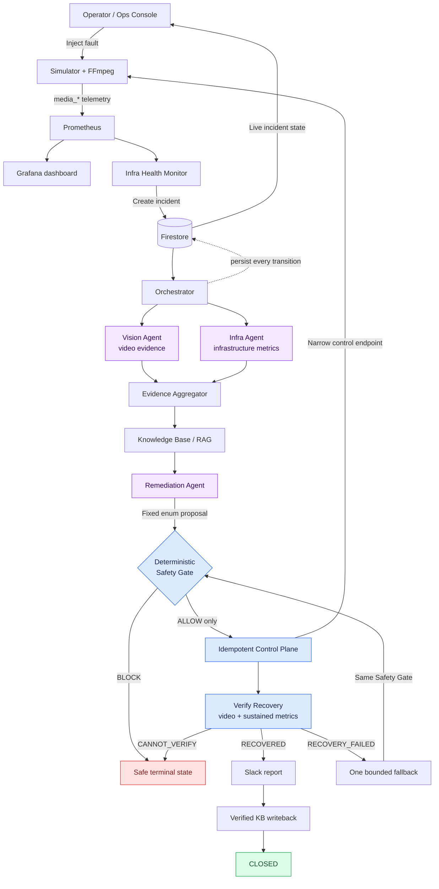

# MediaOps CoPilot

MediaOps CoPilot is an autonomous incident-response system for live video infrastructure. It detects sustained stream failures, investigates the video and telemetry independently, proposes a bounded remediation, passes that proposal through deterministic safety policy, executes the approved action against the real simulator, and independently verifies recovery.

The project is built around one rule:

> **AI supplies judgment. Deterministic code supplies authority.**

Gemini can observe, classify, and propose. It cannot approve an action, execute a fix, or declare recovery. Those responsibilities belong to deterministic Python components with explicit, testable rules.

## What the system demonstrates

- A real FFmpeg media workload driven by a source MP4.
- Controlled encoder overload, encoder failure, and network degradation.
- Prometheus telemetry and a provisioned Grafana dashboard.
- Two independent AI witnesses: video analysis and infrastructure analysis.
- Firestore as the durable source of truth for every incident.
- Retrieval-augmented remediation using verified historical incidents.
- A fail-closed Safety Gate with no AI or LLM dependency.
- Idempotent execution through a single Control Plane.
- Sustained dual-domain recovery verification using metrics and video.
- One bounded fallback attempt that must pass the same gate.
- Slack reporting, verified-outcome knowledge-base writeback, tracing, and PDF reports.
- A browser-based incident console showing the lifecycle in real time.

## Architecture



The purple components use AI for bounded observation and proposals. The blue
components make deterministic safety, execution, and recovery decisions. Every
workflow transition is durably recorded in Firestore.

### Detailed data and control flow

```text
                                    Firestore
                           durable incident state + KB
                                      ▲   │
                                      │   ▼
┌──────────────┐   media_*   ┌───────────────────┐
│ Simulator +  │────────────▶│ Prometheus/Grafana│
│ real FFmpeg  │             └─────────┬─────────┘
│ :8000/:8001  │                       │ read-only telemetry
└──────▲───────┘                       ▼
       │ predefined control      ┌──────────┐
       │ endpoints          │ Infra Health Monitor │
       │                    └─────────┬─────────────┘
       │                              ▼
       │                         incident record
       │                              │
       │                              ▼
       │                     ┌──────────────────┐
       │                     │   Orchestrator   │
       │                     └────────┬─────────┘
       │                              │
       │             ┌────────────────┴────────────────┐
       │             ▼                                 ▼
       │      Vision Agent                       Infra Agent
       │       video pixels                    Prometheus/Grafana
       │             └────────────────┬────────────────┘
       │                              ▼
       │                  Evidence Aggregator
       │                              ▼
       │                  Knowledge Base / RAG
       │                              ▼
       │                   Remediation Agent
       │                     fixed action enum
       │                              ▼
       │                 Safety Gate (deterministic)
       │                       ALLOW / BLOCK
       │                              ▼ ALLOW only
       └──────────────── Control Plane (idempotent)
                                      ▼
                              Verify Recovery
                            video + stable metrics
                                      ▼
                       fallback? → report → KB → close
```

### Complete incident lifecycle

```text
detect → record → diagnose (Vision ∥ Infra) → aggregate → retrieve
       → propose → safety gate → execute → settle → verify
       → fallback once if needed → report → KB writeback → CLOSED
```

Vision and Infra run in parallel. They remain independent witnesses: Vision describes pixels from the fault-specific video section, while Infra classifies bounded read-only telemetry. The aggregator continues only when their evidence is valid and corroborated.

Every transition is persisted to the incident document's `lifecycle_events`, so a process restart or CLI trace does not depend on agent memory.

## Guardrails

### Fixed remediation surface

The only permitted actions are defined by `RemediationAction` in `models.py`:

| Enum action | Real simulator operation |
|---|---|
| `RESTART_ENCODER` | restart the encoder process |
| `REDUCE_PROFILE` | reduce bitrate to 50% |
| `SWITCH_SOURCE` | switch to the backup source |
| `FAILOVER` | invoke the predefined failover action |

The Remediation Agent can select only one of these enum values. It never constructs commands.

### Safety Gate

`safety_gate.py` is pure deterministic Python and defaults to `BLOCK`. `ALLOW` is returned only when every check explicitly passes:

1. Action is in the fixed allow-list.
2. Action is compatible with the diagnosed fault class.
3. Target is an approved canonical component.
4. Evidence exists and confidence meets the configured minimum.
5. Blast radius is within policy.
6. Per-incident action budget is available.
7. Cooldown has elapsed.

A missing value, missing configuration, malformed proposal, failed check, or unexpected exception produces `BLOCK` with a persisted reason.

### Control Plane

`control_plane.py` reads the stored `SafetyDecision`; it never executes directly from a proposal. It requires `ALLOW`, claims the decision's idempotency key atomically in Firestore, and calls one narrow `/control/*` endpoint in the Uvicorn-owned simulator process. Replaying the same incident/key returns the prior execution result without executing twice.

An `ExecutionResult.success` means only that the control call succeeded. It does not mean the stream recovered.

### Recovery verification

`verify_recovery.py` waits for telemetry to settle, samples required Prometheus signals throughout a stable window, and re-runs Vision against the healthy video section. Recovery requires both domains to remain healthy for the entire window:

- `RECOVERED`: metrics and video positively confirm sustained recovery.
- `RECOVERY_FAILED`: still broken, relapsed, or the domains disagree.
- `CANNOT_VERIFY`: reliable evidence was unavailable.

Telemetry unavailability is never interpreted as health. Verification does not close the incident; closure belongs to the orchestrator after reporting and writeback.

## Repository structure

```text
.
├── models.py                  strict Pydantic contracts and enums
├── infra_health_monitor.py    deterministic Prometheus health monitoring
├── incident_recorder.py       Firestore incident persistence and dedup
├── orchestrator.py            full lifecycle coordinator
├── aggregator.py              deterministic dual-domain corroboration
├── knowledge_base.py          Firestore KB, embeddings, cosine retrieval
├── safety_gate.py             deterministic fail-closed policy
├── control_plane.py           ALLOW-only idempotent execution
├── verify_recovery.py         sustained video + telemetry verification
├── fallback.py                one bounded alternate attempt
├── report.py                  one Slack incident report
├── kb_writeback.py            verified-success precedent writeback
├── pdf_report.py              downloadable incident PDF generation
├── observability.py           consistent structured lifecycle logging
├── agents/
│   ├── vision_agent.py        Gemini video symptom classification
│   ├── infra_agent.py         Gemini telemetry fault classification
│   └── remediation_agent.py   Gemini bounded action proposal
├── web/
│   ├── ops_console.py         FastAPI backend; credentials stay server-side
│   ├── static/index.html      single-page incident operations console
│   └── grafana/               provisioned dashboard and datasource
├── tools/
│   ├── trace.py               complete Firestore lifecycle timeline
│   ├── cleanup_incidents.py   preview-first stale incident cleanup
│   ├── seed_knowledge_base.py seeded verified precedents
│   └── incident_cli.py        shared standalone-step runner
├── simulator/                 FFmpeg workload, telemetry, faults, controls
├── prometheus/                Prometheus scrape configuration
├── tests/                     unit and integration tests
├── docker-compose.yml         Prometheus and Grafana
└── requirements.txt           Python dependencies
```

`simulator/control_api.py` owns the simulator state, telemetry loop, metrics server, FFmpeg handle, failure injection, and predefined control actions in one process. Do not start `simulator.pipeline` separately; that would create an isolated state and compete for port 8000.

## Incident data in Firestore

Incidents are stored in the `incidents` collection. The Firestore document ID is the `incident_id` used by every component and CLI.

Important fields include:

| Field | Purpose |
|---|---|
| `status`, `current_step` | current durable workflow position |
| `lifecycle_events` | ordered component/step/outcome timeline |
| `anomaly` | Infra Health Monitor evidence and telemetry snapshot |
| `vision`, `infra` | independent AI findings |
| `evidence` | deterministic aggregation and agreement |
| `precedent` | retrieved KB matches and similarity |
| `proposal` | bounded AI remediation suggestion |
| `safety_decision` | checks, verdict, reason, idempotency key |
| `execution` | control-call result only |
| `verification` | samples, dual-domain result, final verdict |
| `*_history` | original and fallback attempt history |
| `report_sent` | Slack reporting result |
| `kb_writeback_id` | verified precedent written to the KB |
| `terminal_step`, `terminal_reason` | human-readable reason for a safe stop |

Terminal outcomes include `CLOSED`, `BLOCKED`, `CANNOT_VERIFY`, `AUTOMATION_FAILED`, `ESCALATED`, and `FAILED`. Only a verified recovered incident proceeds to successful closure and KB writeback.

## Prerequisites

- Python 3.11+
- FFmpeg on `PATH`
- Docker with Docker Compose
- Google Cloud project with Firestore, Vertex AI, and required APIs enabled
- Google Application Default Credentials for local Firestore/Vertex access
- `uv`/`uvx` when using the Grafana MCP telemetry path
- Optional Slack incoming webhook

macOS examples:

```bash
brew install ffmpeg
brew install --cask docker
brew install uv
gcloud auth application-default login
```

Create a Firestore Native Mode database in the configured project before the first run.

## Configuration

Create a local environment file and never commit its secrets:

```bash
cp .env.example .env
```

The application modules load `.env` through the project configuration path where applicable. You can also export variables in each terminal.

### Required local values

```bash
export GCP_PROJECT_ID="your-google-cloud-project"
export GCP_REGION="us-central1"
export FIRESTORE_DATABASE_ID="(default)"
```

Use Application Default Credentials:

```bash
gcloud auth application-default login
gcloud auth application-default set-quota-project "$GCP_PROJECT_ID"
```

### Grafana MCP for the Infra Agent

Local Grafana is provisioned at `http://localhost:3000`. Create a Viewer service-account token and set:

```bash
export GRAFANA_URL="http://localhost:3000"
export GRAFANA_SERVICE_ACCOUNT_TOKEN="glsa_..."
export GRAFANA_DATASOURCE_UID="mediaops-prometheus"
export INFRA_METRICS_SOURCE="grafana_mcp"
```

For local development without MCP, the deterministic Prometheus HTTP reader is available:

```bash
export INFRA_METRICS_SOURCE="prometheus_http"
export PROMETHEUS_URL="http://localhost:9090"
```

### Slack

`report.py` reads `SLACK_WEBHOOK_URL`:

```bash
export SLACK_WEBHOOK_URL="https://hooks.slack.com/services/..."
```

HTTPS certificate verification uses Certifi by default. Override only when your environment requires a custom bundle:

```bash
export SLACK_CA_BUNDLE="/path/to/ca-bundle.pem"
```

### Safety and verification tuning

| Variable | Default | Meaning |
|---|---:|---|
| `SAFETY_MIN_CONFIDENCE` | `0.80` | minimum proposal/evidence confidence |
| `SAFETY_MAX_ACTIONS` | `2` | per-incident action budget |
| `SAFETY_COOLDOWN_SECONDS` | `15` | time between actions |
| `SAFETY_MAX_BLAST_RADIUS` | `stream` | largest permitted scope |
| `VERIFY_POST_EXECUTION_SETTLE_SECONDS` | `12` | telemetry propagation delay |
| `VERIFY_STABLE_WINDOW_SECONDS` | `15` | sustained healthy window |
| `VERIFY_SAMPLE_INTERVAL_SECONDS` | `3` | metric sampling interval |
| `VERIFY_VIDEO_MIN_CONFIDENCE` | `0.80` | minimum healthy-video confidence |
| `KB_RELEVANCE_THRESHOLD` | `0.80` | minimum cosine similarity |
| `KB_MAX_MATCHES` | `3` | maximum retrieved precedents |

## Run locally

Run commands from the repository root.

### 1. Install Python dependencies

```bash
python3 -m venv .venv
source .venv/bin/activate
python3 -m pip install --upgrade pip
python3 -m pip install -r requirements.txt
```

### 2. Generate the Vision evidence video

The source video is committed, while the derived evidence video is generated
locally and intentionally excluded from Git. Generate it once after cloning:

```bash
python3 simulator/generate_messy_video.py
```

This creates `simulator/output/messy_video.mov`, which the Vision Agent and ops
console use for healthy, overload, RGB-shift, and encoder-failure evidence.

### 3. Start the simulator

Terminal 1:

```bash
python3 -m uvicorn simulator.control_api:app --host 127.0.0.1 --port 8001
```

This single command starts:

- the failure/control API on port 8001;
- the real FFmpeg workload;
- the telemetry loop; and
- Prometheus-format metrics on port 8000.

Do **not** also run `python3 -m simulator.pipeline`.

Verify it:

```bash
curl http://localhost:8001/health
curl http://localhost:8001/state
curl http://localhost:8000/metrics | grep '^media_'
```

### 4. Start Prometheus and Grafana

Terminal 2:

```bash
docker compose up -d prometheus grafana
docker compose ps
```

| Service | URL |
|---|---|
| Simulator state/control | <http://localhost:8001> |
| Raw simulator metrics | <http://localhost:8000/metrics> |
| Prometheus | <http://localhost:9090> |
| Grafana | <http://localhost:3000> |

Prometheus scrapes `host.docker.internal:8000` every five seconds. Grafana is automatically provisioned with the `MediaOps Prometheus` datasource and the `MediaOps` dashboard; no manual dashboard creation is required.

Verify Prometheus:

```bash
curl -G http://localhost:9090/api/v1/query \
  --data-urlencode 'query=media_pipeline_health'
```

### 5. Seed the knowledge base

Run once after Firestore and Vertex AI credentials are ready. The operation is idempotent:

```bash
python3 -m tools.seed_knowledge_base
```

Seed records live in the `knowledge_base` collection and are separate from incident documents.

### 6. Start the operations console

Terminal 3:

```bash
python3 -m uvicorn web.ops_console:app --host 127.0.0.1 --port 8081
```

Open <http://127.0.0.1:8081>.

The console provides:

- guided fault injection;
- healthy → broken → verified-healthy video evidence;
- a real-time one-step workflow card;
- Vision and Infra findings with supporting evidence;
- Safety Gate checks and verification samples;
- an expandable final incident audit;
- a read-only embedded Grafana dashboard;
- a downloadable PDF for closed recovered incidents.

Use one console tab during a live run. The page polls the active incident document and stops polling after a terminal result.

### 7. Run a complete incident

The easiest path is to select a fault in the console. It injects the real simulator fault, waits for sustained detection, creates the incident, and invokes the real orchestrator automatically.

To inject manually:

```bash
curl -X POST http://localhost:8001/failure/encoder-overload
curl -X POST http://localhost:8001/failure/encoder-crash
curl -X POST http://localhost:8001/failure/network-degradation
```

Allow roughly one telemetry update, one Prometheus scrape, and the Infra Health Monitor's 15-second persistence window. A normal detection commonly takes 15–25 seconds after injection.

The reset endpoint is for returning a demo environment to baseline, not for proving automated recovery:

```bash
curl -X POST http://localhost:8001/recovery/reset
```

The Control Plane uses the real predefined endpoints instead:

```text
POST /control/restart-encoder
POST /control/reduce-profile
POST /control/switch-source
POST /control/failover
```

## Run components manually

Every standalone workflow component reads and writes the same Firestore incident document. Replace `<incident_id>` with a real document ID.

```bash
# Independent diagnosis (normally run in parallel)
python3 -m agents.vision_agent <incident_id> overload
python3 -m agents.infra_agent <incident_id>

# Corroborate, retrieve, and propose
python3 aggregator.py <incident_id>
python3 knowledge_base.py <incident_id>
python3 -m agents.remediation_agent <incident_id>

# Deterministic authorization, execution, and verification
python3 safety_gate.py <incident_id>
python3 control_plane.py <incident_id>
python3 verify_recovery.py <incident_id>

# Optional fallback and final outputs
python3 fallback.py <incident_id>
python3 report.py <incident_id>
python3 kb_writeback.py <incident_id>

# Or run the full lifecycle on an already-recorded incident
python3 orchestrator.py <incident_id>
```

Vision's optional second argument selects a video section such as `overload`, `failure`, or `healthy`. The orchestrator normally chooses it from the simulator's actual active-fault state.

## Observe and debug

### Structured logs

Components emit a consistent searchable format containing timestamp, component, incident ID, step/action, and outcome. Run the console or component from a terminal and filter one lifecycle:

```bash
python3 -m uvicorn web.ops_console:app --host 127.0.0.1 --port 8081 2>&1 \
  | grep '<incident_id>'
```

### Complete Firestore trace

```bash
python3 -m tools.trace <incident_id>
```

The trace includes ordered lifecycle events, both findings, agreement, KB matches, proposal, every Safety Gate check, execution, verification samples, fallback, reporting, writeback, and the terminal reason.

### Inspect Firestore

Open the Google Cloud Firestore data viewer for your project and select the `incidents` collection:

```text
https://console.cloud.google.com/firestore/databases/-default-/data/panel/incidents?project=YOUR_PROJECT_ID
```

### Preview and clean stale incidents

The cleanup tool only targets non-terminal incident documents and never touches the `knowledge_base` collection. Preview comes first:

```bash
python3 -m tools.cleanup_incidents --older-than-hours 24
```

Request deletion only after reviewing the preview:

```bash
python3 -m tools.cleanup_incidents --older-than-hours 24 --delete
```

You must type the exact displayed confirmation before anything is deleted.

## Tests

Run the complete suite:

```bash
python3 -m unittest discover -s tests -p 'test_*.py' -v
```

Run focused groups:

```bash
python3 -m unittest tests.test_safety_gate -v
python3 -m unittest tests.test_control_plane -v
python3 -m unittest tests.test_verify_recovery -v
python3 -m unittest tests.test_orchestrator -v
python3 -m unittest tests.test_ops_console -v
```

Tests use fakes/mocks where appropriate and do not require destructive simulator changes. Live end-to-end validation additionally requires the simulator, Prometheus/Grafana, Firestore, and Google credentials.

The real-Firestore CLI integration check is intentionally separate from unit
test discovery:

```bash
python3 -m tools.manual_incident_cli_check
```

## Evaluation

The golden scenarios cover encoder overload, encoder failure, RGB shift, network degradation, and a healthy baseline. AI-agent evaluations use separate Gemini calls; deterministic guardrail and verification cases use controlled inputs and live telemetry where required.

| Agent / behavior | Evaluation |
|---|---|
| Vision Agent | expected symptom for each video section |
| Infra Agent | expected fault class from bounded metrics |
| Remediation Agent | valid enum action and retrieved-case rationale |
| Dual-domain agreement | Vision and Infra corroborate known faults |
| Safety Gate | valid proposal allowed; incompatible and low-confidence proposals blocked |
| Verify Recovery | recovered, still-broken, and unreadable-telemetry verdicts |

Infra may return low-confidence `unknown` for transitional metric windows. The confidence guardrail rejects that uncertainty rather than allowing it to drive an action—an intentional example of AI judgment being bounded by deterministic authority.

## Troubleshooting

### Firestore unavailable or `Internal Server Error`

1. Confirm ADC and project selection:

   ```bash
   gcloud auth application-default login
   gcloud config get-value project
   echo "$GCP_PROJECT_ID"
   ```

2. Confirm Firestore exists in Native Mode and `FIRESTORE_DATABASE_ID` is correct.
3. Keep one console tab open during a run; old cached tabs can continue polling until closed.
4. Restart the console process to create a fresh Firestore gRPC channel.

### Step 1 takes time

The delay is deliberate: simulator telemetry updates every five seconds, Prometheus scrapes every five seconds, the Infra Health Monitor polls every three seconds, and health must stay at zero for 15 seconds. The console displays “Monitoring stream” while confirming persistence.

### Grafana iframe is blank

The Compose configuration already sets:

```text
GF_SECURITY_ALLOW_EMBEDDING=true
GF_AUTH_ANONYMOUS_ENABLED=true
GF_AUTH_ANONYMOUS_ORG_ROLE=Viewer
```

Restart Grafana after configuration changes:

```bash
docker compose up -d --force-recreate grafana
```

The default embedded URL is:

```text
http://localhost:3000/d/mediaops/mediaops?orgId=1&refresh=5s&theme=dark&kiosk
```

Override it with `GRAFANA_EMBED_URL` when necessary.

### Infra Agent cannot start Grafana MCP

Confirm `uvx` is installed, the Viewer token is set, the datasource UID is correct, and Grafana is reachable. For a simpler local path, set `INFRA_METRICS_SOURCE=prometheus_http`.

### Slack report is not sent

Set `SLACK_WEBHOOK_URL` (the exact name consumed by `report.py`). If TLS uses a private CA, set `SLACK_CA_BUNDLE`; otherwise Certifi is used automatically.

### Ports already in use

```bash
lsof -nP -iTCP:8000 -sTCP:LISTEN
lsof -nP -iTCP:8001 -sTCP:LISTEN
lsof -nP -iTCP:8081 -sTCP:LISTEN
```

Stop the stale owning process before restarting the corresponding service. Never start both `simulator.pipeline` and `simulator.control_api`.

## Safety boundaries

- Never give an AI agent execution or approval authority.
- Never execute a proposal that lacks an `ALLOW` SafetyDecision.
- Never treat execution success as recovery.
- Never treat missing telemetry as healthy.
- Never bypass idempotency, action budgets, cooldowns, or compatibility policy.
- Never write an unverified outcome as a successful KB precedent.
- Never expose Firestore, Slack, Grafana service-account, or Google credentials to browser JavaScript or Gemini.

## License

MediaOps CoPilot is available under the [MIT License](LICENSE).
